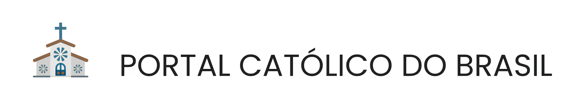

 
 

`Tecnologia em Análise e Desenvolvimento de Sistemas - EAD - UNID. EDUC. PUC MINAS VIRTUAL`

`Eixo 2 - Projeto: Desenvolvimento de uma Aplicação Interativa - Turma 07 - 2024/2`

Este projeto visa solucionar a dificuldade que muitos católicos enfrentam ao buscar informações online sobre paróquias e arquidioceses, como localização de igrejas, horários de missas e agendas de eventos. Para isso, propõe-se o desenvolvimento de um portal prático e acessível, que oferecerá funcionalidades como busca por geolocalização, informações diárias de liturgia e homilia, notícias católicas, agenda de eventos e espaço para publicidades.
 
 

## Integrantes

* Estevão Barboza da Gama dos Reis Silva
* Gabriel Barboza da Gama Reis Silva
* João Henrique Andrade Leite
* Paulo Henrique Sousa Carvalho
* Thainá Crisóstomo Bernardes
* Tobias Quintão Bastos Domingos
 

## Orientador

* Bernardo Jeunon de Alencar
 

## Acesso

* Link de acesso ao portal [https://portalcatolicobrasil.azurewebsites.net](https://portalcatolicobrasil.azurewebsites.net).
 

## Documentação

<ol>
<li><a href="docs/01-Documentação de Contexto.md"> Documentação de Contexto</a></li>
<li><a href="docs/02-Especificação do Projeto.md"> Especificação do Projeto</a></li>
<li><a href="docs/03-Metodologia.md"> Metodologia</a></li>
<li><a href="docs/04-Projeto de Interface.md"> Projeto de Interface</a></li>
<li><a href="docs/05-Arquitetura da Solução.md"> Arquitetura da Solução</a></li>
<li><a href="docs/06-Template Padrão da Aplicação.md"> Template Padrão da Aplicação</a></li>
<li><a href="docs/07-Programação de Funcionalidades.md"> Programação de Funcionalidades</a></li>
<li><a href="docs/08-Plano de Testes de Software.md"> Plano de Testes de Software</a></li>
<li><a href="docs/09-Registro de Testes de Software.md"> Registro de Testes de Software</a></li>
<li><a href="docs/10-Plano de Testes de Usabilidade.md"> Plano de Testes de Usabilidade</a></li>
<li><a href="docs/11-Registro de Testes de Usabilidade.md"> Registro de Testes de Usabilidade</a></li>
<li><a href="docs/12-Apresentação do Projeto.md"> Apresentação do Projeto</a></li>
<li><a href="docs/13-Referências.md"> Referências</a></li>
</ol>
 

## Código

<li><a href="src/PortalCatolico"> Código Fonte</a></li> 

## Apresentação

<li><a href="presentation/README.md"> Apresentação da solução</a></li> 
