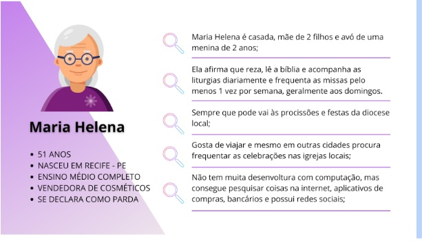

# Especificações do Projeto

Pré-requisitos: <a href="1-Documentação de Contexto.md"> Documentação de Contexto</a>

Definição do problema e ideia de solução a partir da perspectiva do usuário. É composta pela definição do  diagrama de personas, histórias de usuários, requisitos funcionais e não funcionais além das restrições do projeto.

Apresente uma visão geral do que será abordado nesta parte do documento, enumerando as técnicas e/ou ferramentas utilizadas para realizar a especificações do projeto

## Personas

https://g1.globo.com/politica/noticia/2020/01/13/50percent-dos-brasileiros-sao-catolicos-31percent-evangelicos-e-10percent-nao-tem-religiao-diz-datafolha.ghtml acesso em 21/08/2024 às 08:03hs

https://gaudiumpress.org/content/pesquisa-traca-o-perfil-dos-catolicos-no-brasil/ acesso em 21/08/2024 às 08:14hs

https://ideascale.com/pt-br/blogue/definicao-de-mapa-de-persona/ acesso em 21/08/2024 às 13:06hs

## Histórias de Usuários

Com base na análise das personas forma identificadas as seguintes histórias de usuários:

|EU COMO... `PERSONA`| QUERO/PRECISO ... `FUNCIONALIDADE` |PARA ... `MOTIVO/VALOR`                 |
|--------------------|------------------------------------|----------------------------------------|
|Fiel  | Quero acessar as leituras e a homilia do dia           | Para que eu possa me preparar espiritualmente e acompanhar melhor a celebração da missa.               |
|Ana Clara       | Ter um mecanismo eficiente e rápido de comunicação                 | Que eu possa sanar todas as minhas dúvidas rapidamente |

Apresente aqui as histórias de usuário que são relevantes para o projeto de sua solução. As Histórias de Usuário consistem em uma ferramenta poderosa para a compreensão e elicitação dos requisitos funcionais e não funcionais da sua aplicação. Se possível, agrupe as histórias de usuário por contexto, para facilitar consultas recorrentes à essa parte do documento.

> **Links Úteis**:
> - [Histórias de usuários com exemplos e template](https://www.atlassian.com/br/agile/project-management/user-stories)
> - [Como escrever boas histórias de usuário (User Stories)](https://medium.com/vertice/como-escrever-boas-users-stories-hist%C3%B3rias-de-usu%C3%A1rios-b29c75043fac)
> - [User Stories: requisitos que humanos entendem](https://www.luiztools.com.br/post/user-stories-descricao-de-requisitos-que-humanos-entendem/)
> - [Histórias de Usuários: mais exemplos](https://www.reqview.com/doc/user-stories-example.html)
> - [9 Common User Story Mistakes](https://airfocus.com/blog/user-story-mistakes/)

## Requisitos

As tabelas a seguir detalham os requisitos funcionais, não funcionais e restrições do projeto. Para determinar a prioridade de cada requisito, foi utilizado a técnica MoSCoW, que classifica os requisitos em quatro categorias:

<ul>
    <li>Must have (Essenciais): Requisitos indispensáveis para o sucesso do projeto.</li>
    <li>Should have (Importantes): Requisitos importantes, mas que não são críticos.</li>
    <li>Could have (Desejáveis): Requisitos que agregam valor, mas não são prioritários.</li>
    <li>Won’t have (Não necessários agora): Requisitos que podem ser adiados ou excluídos.</li>
</ul>

Cada requisito foi avaliado e categorizado de acordo com seu impacto no objetivo do projeto e nas necessidades dos usuários. A técnica MoSCoW nos permitiu focar nos requisitos mais críticos, garantindo que o projeto atenda suas metas principais dentro dos recursos e prazos disponíveis.
 
 

### Requisitos Funcionais

|ID| Descrição                                                                                                                                                                                                                                                                                                                                                      | Prioridade e Justificativa |
|-------|----------------------------------------------------------------------------------------------------------------------------------------------------------------------------------------------------------------------------------------------------------------------------------------------------------------------------------------------------------------|----|
| RF-01 | <strong>Pesquisar igrejas e horários de missas por geolocalização</strong> 
 <li>Implementar uma funcionalidade de busca que permita aos usuários encontrar igrejas e horários de missas baseados na geolocalização.</li> 
 <li>Desenvolver um sistema de CRUD para gerenciamento das informações de igrejas e missas no banco de dados colaborativo.</li> | <strong>Essencial</strong> 
Principal funcionalidade do portal  | 
| RF-02 | <strong>Trazer informações de Liturgia e homilia do dia</strong> 
 <li>Exibir diariamente as informações de liturgia e homilia do dia, obtidas por meio de uma API confiável.</li>                                                                                                                                                                           | <strong>Essencial</strong> 
Conteúdo diário importante para os usuários.  |
| RF-03 | <strong>Listar eventos das igrejas</strong> 
 <li>Fornecer um formulário para as igrejas divulgarem seus eventos pastorais com um CRUD para gerenciamento dessas informações (gerenciado pelos administradores do site).</li>                                                                                                                                | <strong>Importante</strong> 
Funcionalidade útil, mas não crítica para o projeto | 
| RF-04 | <strong>Disponibilizar espaço para publicidades pagas</strong> 
 <li>Desenvolver um espaço para exibição de publicidades pagas, com possibilidade de gerenciar anúncios e relatórios de desempenho.</li>                                                                                                                                                     | <strong>Desejável</strong> 
Pode gerar receita, mas não é prioritário para o lançamento inicial. |
| RF-05 | <strong>Enviar formulário sobre anúncios publicitários</strong> 
 <li>Oferecer um formulário para que anunciantes enviem informações sobre anúncios publicitários que desejam veicular no portal.</li>                                                                                                                                                       | <strong>Desejável</strong> 
Simplifica o processo de inserção de anúncios, podendo aumentar as oportunidades de monetização do portal. |
| RF-06 | <strong>Enviar formulário para Cadastro de Paróquias e Missas</strong> 
 <li>Criar um formulário para que os usuários enviem dados de suas paróquias e horários de missas. As informações serão validadas antes de serem inseridas no banco de dados.</li>                                                                                                   | <strong>Importante</strong> 
Facilita a expansão do banco de dados de forma colaborativa, com possível suporte da PUC para o fornecimento ou colaboração nas cargas de dados. |
| RF-07 | <strong>Enviar formulário de dados sobre horários das missas</strong> 
 <li>Disponibilizar um formulário específico para que os usuários enviem informações detalhadas sobre os horários das missas em suas paróquias.</li>                                                                                                                                  | <strong>Importante</strong> 
Permite a atualização contínua e precisa dos horários de missas, melhorando a confiabilidade das informações no portal. |
| RF-08 | <strong>Enviar formulário sobre os eventos das paróquias</strong> 
 <li>Disponibilizar um formulário para que as paróquias possam enviar detalhes sobre seus eventos, como festas, novenas e encontros.</li>                                                                                                                                                 | <strong>Importante</strong> 
Facilita a divulgação de eventos, aumentando o engajamento da comunidade e a utilidade do portal. |
| RF-09 | <strong>Gerenciar informações do portal</strong> 
 <li>Desenvolver um módulo simples para que gestores/desenvolvedores possam gerenciar todas as informações do portal, incluindo usuários, conteúdos, anúncios e eventos.</li>                                                                                                                              | <strong>Essencial</strong> 
Essencial para a manutenção e administração eficiente do portal, garantindo que todas as informações estejam atualizadas e corretas. |

**Prioridade: Essencial (Must have) / Importante (Should have) / Desejável (Could have).** 
 
 

### Requisitos não Funcionais

|ID      | Descrição               | Prioridade e Justificativa |
|--------|-------------------------|----|
| RNF-01 |  <strong>Compatibilidade e responsividade</strong> 
 <li>A aplicação deve ser responsiva, adaptando-se a diferentes tamanhos de tela e dispositivos, como celulares, tablets e desktops.</li> | <strong>Essencial</strong> 
Garantir que o portal funcione bem em todos os dispositivos é crucial para oferecer uma boa experiência de usuário e atender às expectativas modernas de acessibilidade e usabilidade. |
| RNF-02 |  <strong>Santo do dia</strong> 
 <li>Exibir o santo do dia com informações relevantes, sem necessidade de CRUD, utilizando uma fonte estática ou API externa.</li> | <strong>Importante</strong> 
Relevante para a experiência do usuário, mas não essencial para o funcionamento. |
| RNF-03 |  <strong>Matérias relevantes</strong> 
 <li>Implementar uma área para matérias relevantes com foco em temas católicos, utilizando integração com fontes RSS ou APIs de notícias.</li> | <strong>Desejável</strong> 
Aumenta o engajamento, mas pode ser adicionado em uma versão posterior. | 

**Prioridade: Essencial (Must have) / Importante (Should have) / Desejável (Could have).**
 
 

## Restrições

O projeto está restrito pelos itens apresentados na tabela a seguir:

ID      | Restrição               |
|--------|-------------------------|
| 01 | Backend desenvolvido em C#.|
| 02 | Frontend desenvolvido com HTML, CSS e Bootstrap.|
| 03 | Necessidade do uso de pelo menos uma API.|
| 04 | Banco de dados MySQL, com implementação de 2 a 3 CRUD’s (por exemplo, para gestão de igrejas, missas e eventos).|
| 05 | Hospedagem na AWS ou Azure, com integração de SGBD (Sistema de Gerenciamento de Banco de Dados).|
| 06 | Conformidade com a LGPD para proteção de dados pessoais.|
| 07 | Autorização para uso de conteúdo externo, como liturgias e notícias.|
 
 

## Diagrama de Casos de Uso

