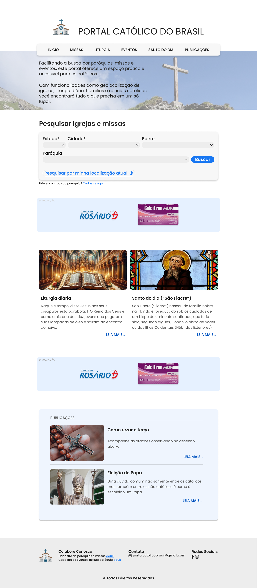
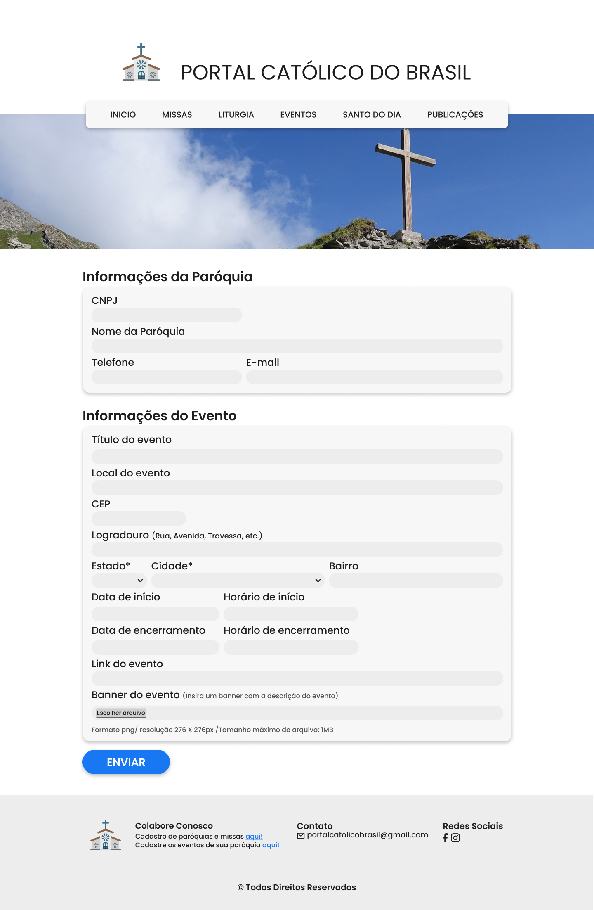

# Projeto de Interface

Demonstramos aqui os wireframes estáticos e interativo criados com base na proposta de aplicação a ser desenvolvida neste semestre por nossa equipe. Trazendo consigo um design tido como foco principal o público que gosta ou precisa de objetividade nos resultados, apresentamos aqui: 

## Página Inicial

A página inicial do <strong>Portal Católico do Brasil</strong> foi projetada para ser prática e intuitiva, facilitando a navegação e a busca por informações de paróquias e missas. A estrutura principal está dividida da seguinte forma:

<ul>
 <li><strong>Cabeçalho (Header):</strong> Contém o logotipo do portal e um menu de navegação com as seguintes seções:</li>
 <ul>
  <li><strong>Início:</strong> Retorna à página principal.</li>
  <li><strong>Missas:</strong> Direciona para a pesquisa de horários de missas.</li>
  <li><strong>Liturgia:</strong> Acessa informações sobre a liturgia diária.</li>
  <li><strong>Santo do Dia:</strong> Exibe o santo do dia com informações detalhadas.</li>
  <li><strong>Eventos:</strong> Lista os eventos católicos em destaque.</li>
  <li><strong>Artigos:</strong> Seção dedicada a artigos relacionados à fé católica e temas afins.</li>
 </ul>
 <li><strong>Área de Busca:</strong> Uma ferramenta de pesquisa que permite ao usuário encontrar paróquias e horários de missas, filtrando por estado, cidade e bairro, ou utilizando a geolocalização atual do usuário.</li>
 <li><strong>Sessões Informativas:</strong></li>
  <ul>
   <li><strong>Liturgia diária:</strong> Exibe um resumo da liturgia do dia.</li>
   <li><strong>Santo do Dia:</strong> Informações sobre o santo comemorado naquele dia.</li>
  </ul>
 <li><strong>Seção de Artigos:</strong> Apresenta artigos de interesse católico, como "Como rezar o terço" e "Eleição do Papa".</li>
 <li><strong>Banners Publicitários:</strong> Espaço reservado para patrocinadores e anúncios.</li>
 <li><strong>Rodapé (Footer):</strong> Contém links para colaboração (onde paróquias podem ser cadastradas), informações de contato e ícones de redes sociais.</li>
</ul>
 

 
 

## Resultado da Pesquisa de Missas

Esta página exibe os resultados detalhados da pesquisa de missas realizadas pelos usuários, com as seguintes informações:

<ul>
 <li><strong>Dados da Paróquia:</strong> Para cada paróquia listada, são exibidos:</li>
 <ul>
  <li><strong>Endereço:</strong> Localização completa da paróquia, com telefone de contato.</li>
  <li><strong>Horários de Missa:</strong> Detalhes dos horários de missa por dia da semana.</li>
 </ul>
  <li><strong>Botão "Ver no mapa":</strong> Disponível em cada paróquia, direciona o usuário para uma visualização do local da paróquia no mapa.</li>
  <li><strong>Rodapé:</strong> Semelhante às outras páginas, oferece links para colaborar, informações de contato e ícones de redes sociais, além de um link para cadastrar novas paróquias.</li>
</ul>
 

 
 

## Cadastro das Paróquias

Nesta etapa, são coletadas as informações das paróquias que farão parte do portal, garantindo que os dados estejam atualizados e completos. Os campos solicitados incluem:

<ul>
 <li><strong>Dados da Paróquia:</strong> Para cada paróquia a ser cadastrada, são solicitados:</li>
 <ul>
  <li><strong>CNPJ:</strong> Utilizado como principal forma de validação dos dados cadastrados.</li>
  <li><strong>Nome da Paróquia:</strong> O nome oficial e completo da paróquia.</li>
  <li><strong>Telefone:</strong> Número de telefone principal para contato direto com a instituição.</li>
  <li><strong>E-mail:</strong> Endereço de e-mail para comunicações e contato oficial./li>
 </ul>
  <li><strong>Endereço da Paróquia:</strong> Inclui o estado, cidade, logradouro, número e CEP da paróquia.</li>
  <li><strong>Informações das Missas:</strong> Dias e horários específicos em que a paróquia realiza suas celebrações.</li>
</ul>
 

 
 

## Liturgia Diária

A página de Liturgia do Portal Católico do Brasil apresenta o conteúdo litúrgico do dia, incluindo as leituras bíblicas e homilias. Sua estrutura é composta por:

<ul>
	<li><strong>Cabeçalho (Header):</strong> Contém o logotipo do portal e um menu de navegação com as seguintes seções:</li>
	<ul>
		<li><strong>Início:</strong> Retorna à página principal.</li>
		<li><strong>Missas:</strong> Direciona para a pesquisa de horários de missas.</li>
		<li><strong>Liturgia:</strong> Acessa informações sobre a liturgia diária.</li>
		<li><strong>Santo do Dia:</strong> Exibe o santo do dia com informações detalhadas.</li>
		<li><strong>Eventos:</strong> Lista os eventos católicos em destaque.</li>
		<li><strong>Artigos:</strong> Seção dedicada a artigos relacionados à fé católica.</li>
 	</ul>
  	<li><strong>Liturgia do Dia:</strong> Exibe o conteúdo litúrgico do dia, incluindo:</li>
  	<ul>
		<li><strong>1ª Leitura:</strong> Apresenta a primeira leitura do dia com referências bíblicas e texto.</li>
		<li><strong>Salmo:</strong> Texto do salmo correspondente ao dia.</li>
		<li><strong>2ª Leitura (Específica dos domingos):</strong> Segunda leitura bíblica do dia.</li>
		<li><strong>Homilia:</strong> Reflexão ou comentário sobre o evangelho do dia.</li>
 	</ul>
  	<li><strong>Rodapé (Footer):</strong> Contém links para colaboração (onde paróquias podem ser cadastradas), informações de contato e ícones de redes sociais.</li>
</ul>
 

 
 

## Lista de Eventos

Nesta página é permitido aos usuários pesquisarem eventos católicos em diferentes localidades e oferecido as 
seguintes 
funcionalidades:

<ul>
 <li><strong>Área de Busca:</strong> Similar à tela de pesquisa de missas, os usuários podem filtrar eventos por estado, cidade, bairro e paróquia, com a opção de usar a localização atual para facilitar a pesquisa.</li>
 <li><strong>Resultados da Pesquisa:</strong> Após realizar a busca, os eventos encontrados são exibidos em uma lista que inclui:</li>
 <ul>
  <li><strong>Data do evento:</strong> Mostrada em destaque.</li>
  <li><strong>Título do evento:</strong> Nome completo do evento.</li>
  <li><strong>Local e horário:</strong> Informações sobre o local, paróquia e horário de início e término do evento.</li>
  <li><strong>Botão "Ver no mapa":</strong> Direciona o usuário para o mapa com a localização exata do evento.</li>
 </ul>
 <li><strong>Rodapé:</strong> Contém links para colaboração (onde eventos podem ser cadastrados), informações de contato e ícones de redes sociais.</li>
</ul>
 

 
 

## Cadastro de Eventos

A página de Cadastro de Eventos foi projetada para facilitar a inserção de eventos no Portal Católico do Brasil, proporcionando um formulário simples e intuitivo para as paróquias divulgarem suas atividades.

#### A estrutura principal está dividida da seguinte forma:
<ul>
	<li><strong>Cabeçalho (Header):</strong> Similar às outras páginas, contém o logotipo do portal e um menu de navegação com as seguintes seções:</li>
	<ul>
		<li><strong>Início:</strong> Retorna à página principal.</li>
		<li><strong>Missas:</strong> Direciona para a pesquisa de horários de missas.</li>
		<li><strong>Liturgia:</strong> Acessa informações sobre a liturgia diária.</li>
		<li><strong>Santo do Dia:</strong> Exibe o santo do dia com informações detalhadas.</li>
		<li><strong>Eventos:</strong> Lista os eventos católicos em destaque.</li>
		<li><strong>Artigos:</strong> Seção dedicada a artigos relacionados à fé católica.</li>
 	</ul>
  	<li><strong>Formulário de Cadastro de Eventos:</strong></li>
		<ul>
			<li><strong>Informações da Paróquia:</strong></li>
			<ul>
				<li><strong>CNPJ:</strong> Campo obrigatório para o número de registro da paróquia.</li>
				<li><strong>Nome da Paróquia:</strong> Campo para inserir o nome da igreja.</li>
				<li><strong>Telefone e E-mail:</strong> Contato da paróquia para facilitar o suporte e a comunicação.</li>
			</ul>
			<li><strong>Informações do Evento:</strong></li>
			<ul>
				<li><strong>Título do Evento:</strong> Nome ou descrição principal do evento.</li>
				<li><strong>Local do Evento:</strong> Endereço completo, com CEP, logradouro, e opções para selecionar estado, cidade e bairro.</li>
				<li><strong>Data e Hora:</strong> CCampos para inserir a data e hora de início e término do evento.</li>
				<li><strong>Link do Evento:</strong> Campo opcional para adicionar um link com mais informações sobre o evento.</li>
				<li><strong>Banner do Evento:</strong> Opção para upload de uma imagem representando o evento, com requisitos de formato e tamanho (PNG, máximo 1 MB).</li>
			</ul>
		</ul>
  	<li><strong>Botão de Envio:</strong> Um botão de ação destacado "ENVIAR" ao final do formulário, que processa as informações inseridas e as envia ao sistema do portal.</li>
  	<li><strong>Rodapé (Footer):</strong> O rodapé oferece opções de colaboração, como links para o cadastramento de paróquias, informações de contato (e-mail), e ícones de redes sociais para o Facebook e Instagram do portal.</li>
</ul>
 

 
 

## Santo do Dia

A página de Cadastro de Eventos foi projetada para facilitar a inserção de eventos no Portal Católico do Brasil, proporcionando um formulário simples e intuitivo para as paróquias divulgarem suas atividades.

#### A estrutura principal está dividida da seguinte forma:
<ul>
	<li><strong>Cabeçalho (Header):</strong> Similar às outras páginas, contém o logotipo do portal e um menu de navegação com as seguintes seções:</li>
	<ul>
		<li><strong>Início:</strong> Retorna à página principal.</li>
		<li><strong>Missas:</strong> Direciona para a pesquisa de horários de missas.</li>
		<li><strong>Liturgia:</strong> Acessa informações sobre a liturgia diária.</li>
		<li><strong>Santo do Dia:</strong> Exibe o santo do dia com informações detalhadas.</li>
		<li><strong>Eventos:</strong> Lista os eventos católicos em destaque.</li>
		<li><strong>Artigos:</strong> Seção dedicada a artigos relacionados à fé católica.</li>
 	</ul>
  	<li><strong>Conteúdo Principal:</strong></li>
		<ul>
			<li>Imagem, data e título do Santo do Dia.</li>
			<li>Breve biografia do Santo celebrado.</li>
		</ul>
  	<li><strong>Rodapé (Footer):</strong> O rodapé oferece opções de colaboração, como links para o cadastramento de paróquias, informações de contato (e-mail), e ícones de redes sociais para o Facebook e Instagram do portal.</li>
</ul>
 

 
 

## Artigos

A página de Artigos do Portal Católico do Brasil oferece conteúdo informativo e catequético para os usuários. Sua estrutura está organizada da seguinte forma:

<ul>
	<li><strong>Cabeçalho (Header):</strong> Contém o logotipo do portal e um menu de navegação com as seguintes seções:</li>
	<ul>
		<li><strong>Início:</strong> Retorna à página principal.</li>
		<li><strong>Missas:</strong> Direciona para a pesquisa de horários de missas.</li>
		<li><strong>Liturgia:</strong> Acessa informações sobre a liturgia diária.</li>
		<li><strong>Santo do Dia:</strong> Exibe o santo do dia com informações detalhadas.</li>
		<li><strong>Eventos:</strong> Lista os eventos católicos em destaque.</li>
		<li><strong>Artigos:</strong> Seção dedicada a artigos relacionados à fé católica.</li>
 	</ul>
  	<li><strong>Seção de Artigos:</strong> Apresenta artigos específicos com links para leituras completas:</li>
  	<ul>
		<li><strong>Como rezar o terço:</strong> Explicação sobre como rezar o terço, com detalhes ilustrativos.</li>
		<li><strong>Eleição do Papa:</strong> Artigo que esclarece o processo de escolha de um Papa, voltado para católicos e não católicos.</li>
 	</ul>
  	<li><strong>Banners Publicitários:</strong> Espaço reservado para patrocinadores e anúncios.</li>
  	<li><strong>Rodapé (Footer):</strong> Contém links para colaboração (onde paróquias podem ser cadastradas), informações de contato e ícones de redes sociais.</li>
</ul>
 

 
 

## Artigo: Como Rezar o Terço

A página de artigo do Portal Católico do Brasil foi projetada para ser clara e informativa, proporcionando aos usuários um guia visual e detalhado sobre a prática da oração do terço. O conteúdo é fácil de navegar e inclui recursos gráficos para facilitar o aprendizado.

#### A estrutura principal está dividida da seguinte forma:
<ul>
	<li><strong>Cabeçalho (Header):</strong> Contém o logotipo do portal e um menu de navegação com as seguintes seções:</li>
	<ul>
		<li><strong>Início:</strong> Retorna à página principal.</li>
		<li><strong>Missas:</strong> Direciona para a pesquisa de horários de missas.</li>
		<li><strong>Liturgia:</strong> Acessa informações sobre a liturgia diária.</li>
		<li><strong>Santo do Dia:</strong> Exibe o santo do dia com informações detalhadas.</li>
		<li><strong>Eventos:</strong> Lista os eventos católicos em destaque.</li>
		<li><strong>Artigos:</strong> Seção dedicada a artigos relacionados à fé católica.</li>
 	</ul>
  	<li><strong>Corpo do Artigo:</strong> O artigo "Como Rezar o Terço" está dividido em partes, oferecendo instruções claras e ilustradas sobre a sequência correta de orações e meditações.</li>
  	<li><strong>Fontes:</strong> Ao final do artigo, há uma seção que atribui os créditos à fonte do conteúdo.</li>
  	<li><strong>Banners Publicitários:</strong> Espaço reservado para patrocinadores e anúncios.</li>
  	<li><strong>Rodapé (Footer):</strong> Contém links para colaboração (onde paróquias podem ser cadastradas), informações de contato e ícones de redes sociais.</li>
</ul>
 

 
 

[<strong>ACESSE AQUI O WIREFRAME INTERATIVO!</strong>](https://www.figma.com/proto/QpqN5RPe7VqWSaFD9z1I5E/Untitled?node-id=0-1&t=Tpzae9N6ynFhrrCG-1)

