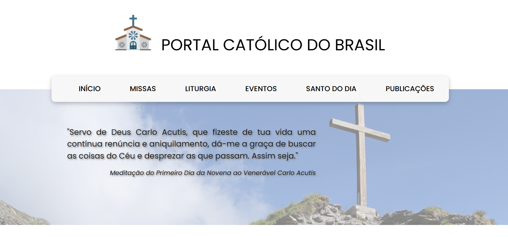
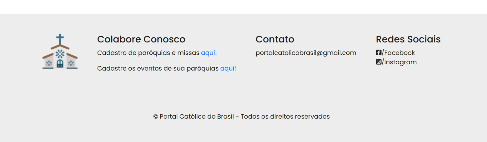
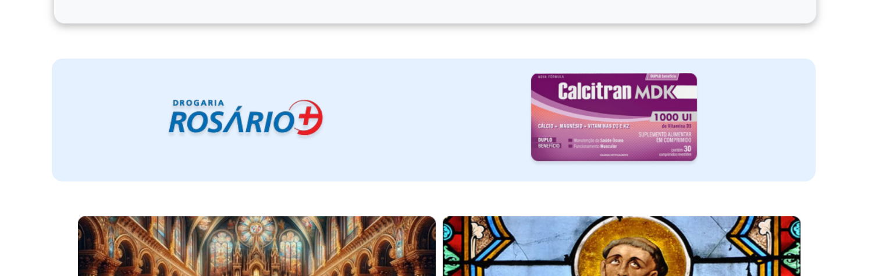
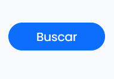

# Template Padrão da Aplicação

Pré-requisitos: <a href="2-Especificação do Projeto.md"> Especificação do Projeto</a>, <a href="3-Projeto de Interface.md"> Projeto de Interface</a>, <a href="4-Metodologia.md"> Metodologia</a>

O layout padrão do site foi construído com as linguagens de marcação HTML, CSS e o framework Bootstrap.

As páginas terão como elementos comuns o header, o menu de navegação e o footer, bem como a responsividade de todas as telas, a formatação dos botões e cores da sessão de anúncio, além dos elementos de identidade visual citados abaixo:

<li>font-family: poppins-regular;
<li>font-color padrão: #1E1E1E;
<li>background-color área de anúncios: #E6F1FF !important;
<li>background-color do footer: #EDEDED;
<li>background-color do menu: #F7F7F7;
<li>background-color padrão: white;
<li>Formatação Botões: btn btn-primary;

As cores e fontes do site foram pensadas para falicitar a leitura do público alvo, que em sua maioria são pessoas mais velhas. Por isso utilizamos alto contraste entre as fontes e os backgrounds em todos os elementos, bem como tamanhos grandes nos caracteres; Priorizamos as cores "Branca" e "Azul" nas suas várias tonalidades pois remetem ao celeste, às coisas do céu, como exemplifica a imagem do head que aparece em todas as páginas do site; A navegabilidade foi outro ponto que foi pensado de modo a facilitar a interação do usuário. Trouxemos todas as funcionaliades no menu principal bem como uma prévia de todas elas distribuídas na página de início;

Abaixo estão os elementos padrões de todas as páginas:

<h4>Head:</h4>

  <h4>Footer:</h4>

  <h4>Área de anúncio:</h4>

  <h4>Botões:</h4>

<!--Layout padrão da aplicação que será utilizado em todas as páginas com a definição de identidade visual, aspectos de responsividade e iconografia.

> **Links Úteis**:
>
> - [CSS Website Layout (W3Schools)](https://www.w3schools.com/css/css_website_layout.asp)
> - [Website Page Layouts](http://www.cellbiol.com/bioinformatics_web_development/chapter-3-your-first-web-page-learning-html-and-css/website-page-layouts/)
> - [Perfect Liquid Layout](https://matthewjamestaylor.com/perfect-liquid-layouts)
> - [How and Why Icons Improve Your Web Design](https://usabilla.com/blog/how-and-why-icons-improve-you-web-design/)
-->
